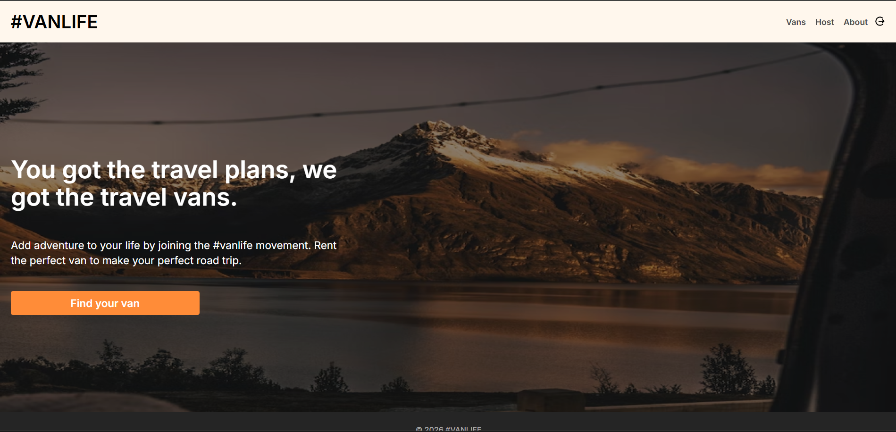
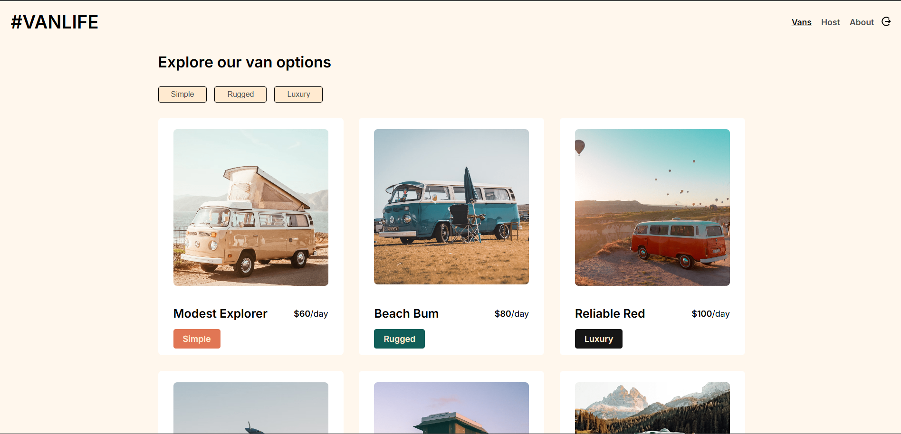
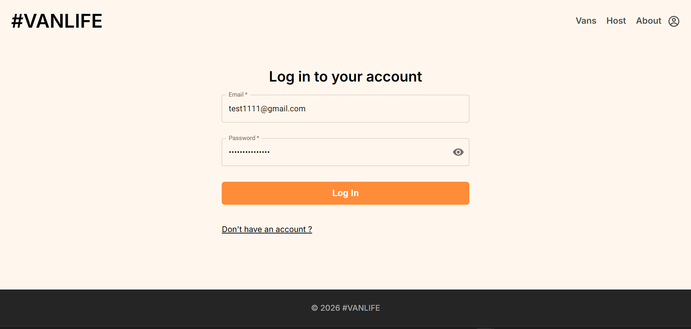
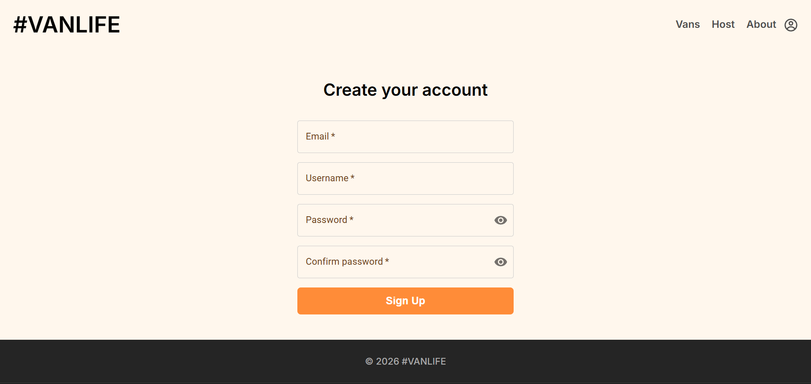
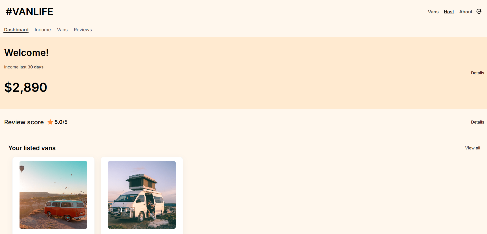
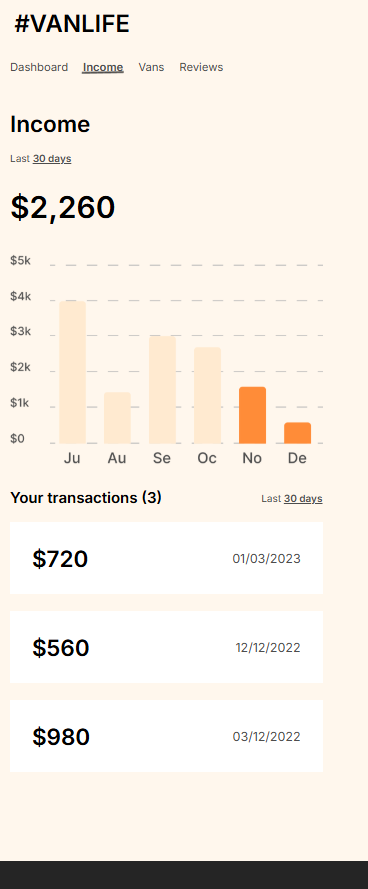
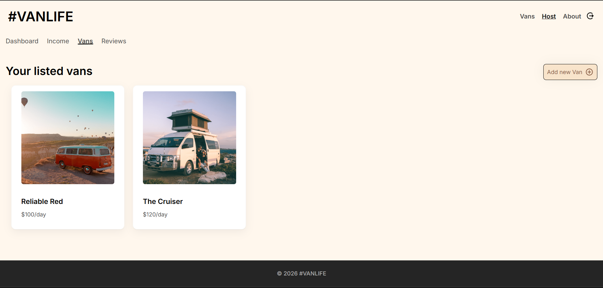
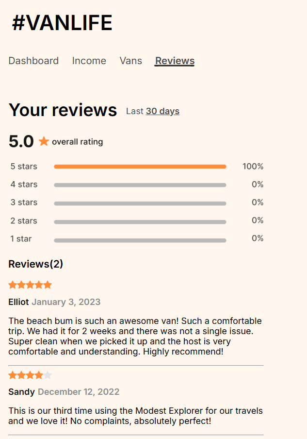
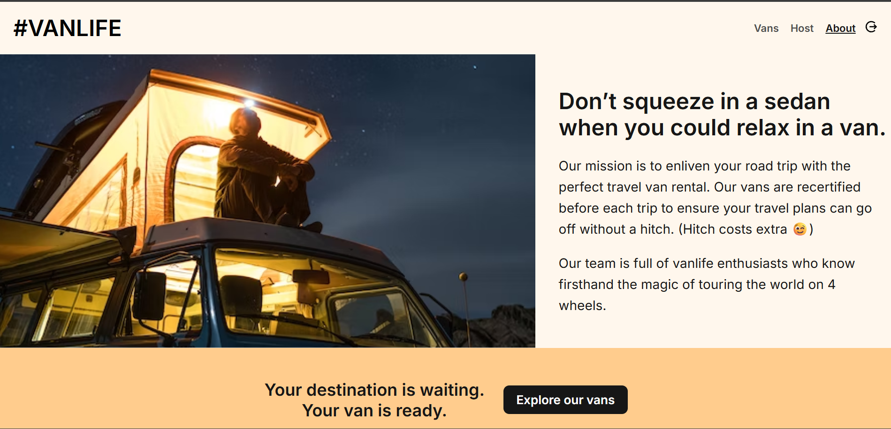

# 🚐 VanLife – Van Renting Demo App 

VanLife is a full-stack MERN-style application that simulates a van rental platform for family travelers. It allows users to explore vans and enables hosts to manage their own listings through a secure, authenticated dashboard.

🔗 **Live Demo:** [https://van-life-react-js-project.vercel.app/](https://van-life-react-js-project.vercel.app/)

---

## ✨ Features

### 👤 Public Users

* Browse all available vans
* Filter vans by type
* View detailed van information
* Responsive home and about pages

### 🧑‍💼 Host (Authenticated)

* Secure login & signup
* Add new vans
* Edit existing vans
* Delete vans
* View dashboard with:

  * Income (demo)
  * Reviews (demo)

---

## 🔐 Authentication & Authorization

* JWT-based authentication (Access + Refresh Tokens)
* Protected routes (frontend & backend)
* Only authenticated hosts can access host dashboard
* Resource ownership enforced (hosts can manage only their vans)
* Refresh token implemented (no rotation for simplicity)

---

## 🛠️ Tech Stack

**Frontend**

* React (Vite)
* HTML, CSS, JavaScript

**Backend**

* Node.js
* Express

**Database**

* MongoDB Atlas

**Authentication**

* JSON Web Tokens (JWT)

---

## 🧠 Key Concepts & Learnings

* Implemented JWT authentication with access & refresh tokens
* Built protected routes on both frontend and backend
* Designed RESTful APIs
* Implemented authorization (ownership checks)
* Handled image URLs for dynamic rendering of van images
* Managed global auth state using React Context

---

## ⚙️ Environment Variables

### Frontend (.env)

```bash
VITE_API_URL=
```

### Backend (.env)

```bash
ACCESS_TOKEN_SECRET=
REFRESH_TOKEN_SECRET=

ACCESS_TOKEN_EXPIRY=15m
REFRESH_TOKEN_EXPIRY=7d

MONGODB_URL=
CLIENT_URL=

PORT=
```

---

## 🚀 Installation & Setup

### 1. Clone the repository

```bash
git clone https://github.com/YOUR-USERNAME/YOUR-REPO-NAME.git
cd YOUR-REPO-NAME
```

### 2. Setup Backend

```bash
cd Backend
npm install
npm run dev
```

### 3. Setup Frontend

```bash
cd Frontend
npm install
npm run dev
```

---

## 🔄 API Overview

```bash
GET     /api/vans              → Get all vans
GET     /api/vans/:id         → Get single van

POST    /api/auth/signup      → Register user
POST    /api/auth/login       → Login user
GET     /api/auth/refresh     → Refresh access token

GET     /api/host/vans        → Get host vans
POST    /api/host/vans        → Create van
PUT     /api/host/vans/:id    → Update van
DELETE  /api/host/vans/:id    → Delete van
```

---

## 📁 Project Structure

<details>
<summary>Click to expand</summary>

### Frontend

```
Frontend/
├── Context/
├── src/
│   ├── components/
│   ├── pages/
│   ├── utils/
│   ├── App.jsx
```

### Backend

```
Backend/
├── controllers/
├── middleware/
├── models/
├── routes/
├── utils/
├── server.js
```

</details>

---

## 📸 Screenshots

> Add screenshots here (recommended)

```md









```

---

## ⚠️ Limitations

* Booking functionality not implemented yet
* Payment integration not available
* Refresh token rotation not implemented
* Income and reviews are static (demo data)

---

## 🚧 Future Improvements

* Add booking system
* Integrate payment gateway (e.g., Stripe)
* Implement refresh token rotation
* Improve UI/UX
* Add analytics for hosts

---

## 💡 Why I Built This

This project was built to practice full-stack development by implementing a real-world scenario involving authentication, protected routes, CRUD operations, and managing dynamic data through APIs.

---

## 👨‍💻 Author

* GitHub: [https://https://github.com/MhdSinanC/VanLife-React.js-Project](https://ghttps://github.com/MhdSinanC/VanLife-React.js-Project)

---

## ⭐ Show Your Support

If you like this project, consider giving it a ⭐ on GitHub!